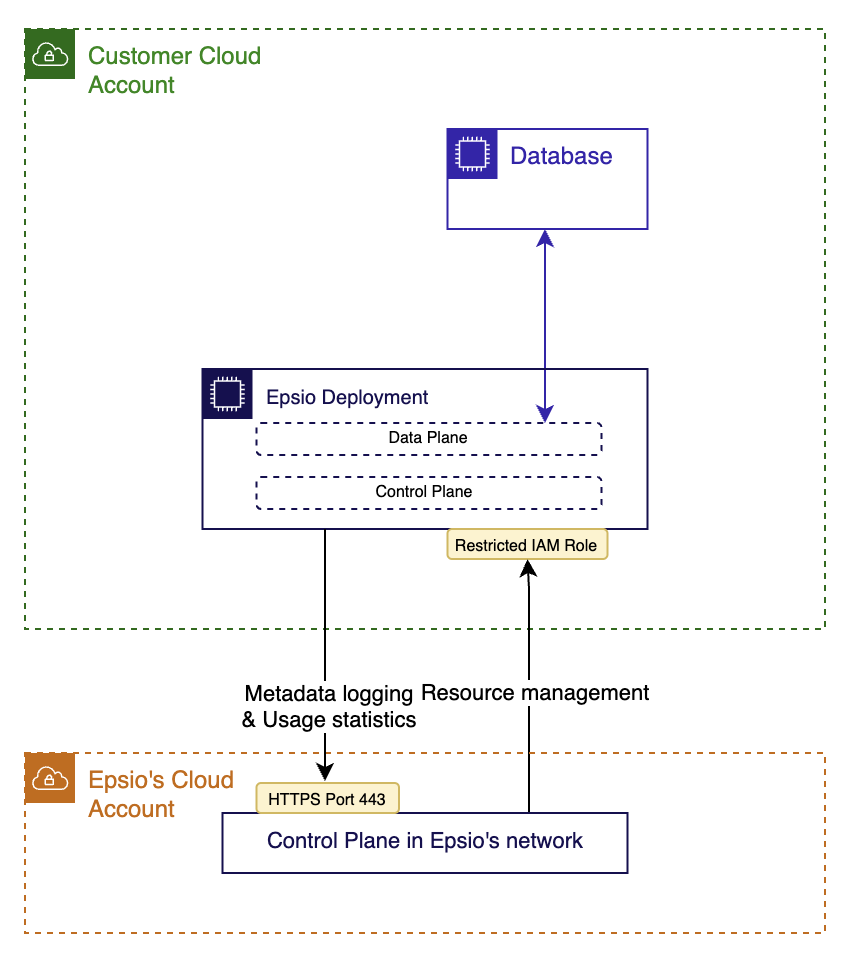

# Data Privacy and Security

At Epsio, we take data privacy very seriously. We understand that keeping sensitive data secure is crucial to building trust with our users. That's why we developed Epsio with an architecture that ensures Epsio Cloud does not have access to your sensitive data.

## Architecture
The architecture of an Epsio deployment is split into two separate planes. The control plane is the plane where Epsio manages the size of the deployment, gets usage statistics, and runs software updates. The data plane handles the actual data processing of database data.

<figure markdown>
  { width="400" loading=lazy}
  <figcaption>Deployment Network Diagram</figcaption>
</figure>

## How is the control plane separated from the data plane?
Epsio Cloud communicates with Epsio Deployments to manipulate resources, obtain usage statistics, and manage software upgrades. However, all data processing is done entirely on the compute instances deployed in the customer's environment, and Epsio Cloud cannot access the processed data.

The separation of management and data processing ensures that Epsio provides the benefits of a managed service while maintaining the privacy and security of customer data.