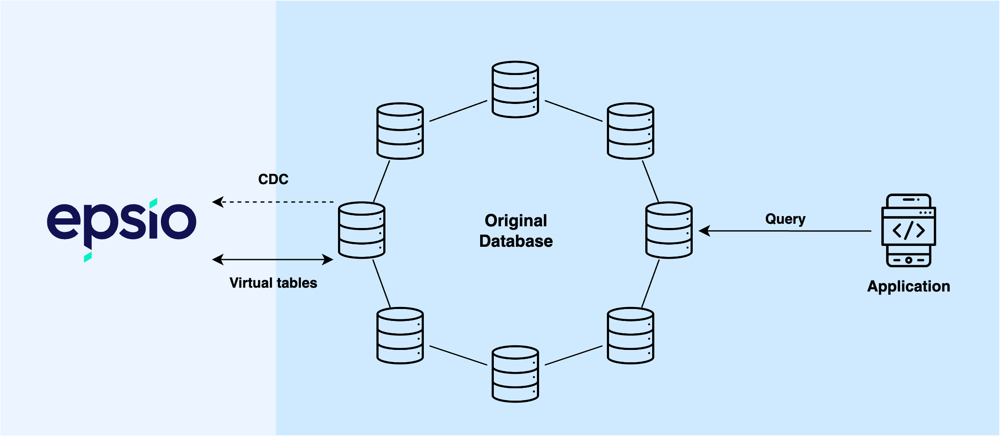

# Integrating Epsio

We understand that integration is a critical aspect of bringing in any new technology, and so much more in the world of databases. To make the integration as seamless as possible, we have built Epsio in a way that it will only require to run a few SQL commands on your original database to onboard / integrate, and zero changes in the backend.

Epsio works similarly to an extra "read replica" - it consumes changes from the database (WAL) as they occur, and continuously updates the results of specific queries.

For each query the user wants Epsio to maintain, Epsio creates a “virtual table” (utilizing foreign data wrappers in PostgreSQL) in the existing database which, when queried, will be forwarded to Epsio. **To get the results, the application simply needs to** **query the original database**, thereby staying agnostic to Epsio.

<figure markdown>
  { width="800" loading=lazy}
</figure>

Our integration gives some key benefits:

**Fast Onboarding:** Only a few commands need to be run in the original database to configure the CDC and virtual tables, and the backend does not need to be configured at all.

**Ease of Use:** Epsio allows your backend code to query the same database using the same syntax, making it effortless to implement.

**Low Risk:** Epsio avoids the risk of being a single point of failure by not acting as a proxy.
