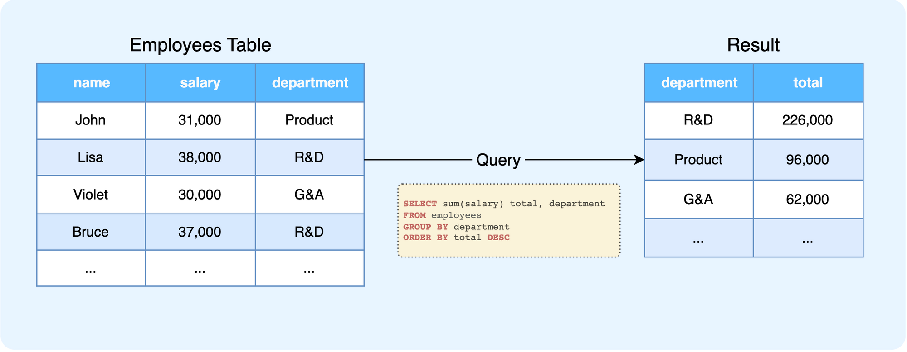
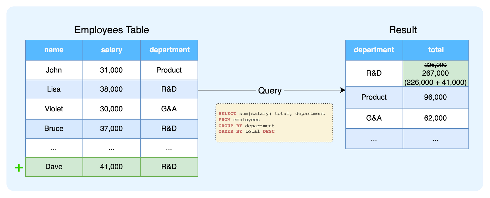

# Overview

Epsio plugs into **existing databases** and constantly updates results for queries you define whenever the underlying data changes, without ever re-calculating the entire dataset. This approach allows Epsio to provide **instant and always up-to-date results** for complex queries while also reducing costs.  

<div style="display: flex;">
    <div style="flex:50%;    text-align: center;padding:5px"></div>
    <div style="flex:50%;    text-align: center;padding:5px"></div>
</div>

<video style="margin-top:0px" playsinline loop autoplay muted default-playback-rate=5>
  <source src="./assets/IVM.mp4" type="video/mp4">
</video>
<script> document.querySelector('video').playbackRate = 2.0;</script>
Epsio supports most SQL syntax, including most types of `JOIN`s, `CTE`s, subqueries, `GROUP BY`, and more.

##How does it work?

As an example, imagine a database table that contains the salaries of all employees within a company, and a complex query that calculates the sum of salaries by department:

<figure><figcaption></figcaption></figure>

As new data arrives or existing data is updated, the answer needs to change accordingly. While traditional databases need to rerun the entire query to do this, Epsio will only perform the minimum calculations needed - in this case, adding or subtracting the new salary from the relevant department:

<figure><figcaption></figcaption></figure>

As the above calculation is very efficient (compared to recalculating the entire query), this results in **massively reduced query times, significant cost savings, and a highly scalable architecture**.

##Usage
To configure Epsio to incrementally maintain the results of a heavy query, call the `create_view` function with the name and query parameters: 
```postgresql title="Define the Epsio View"
postgres=# CALL epsio.create_view('epsio_view', 
  'SELECT SUM(SALARY), d.name FROM employee_salaries e
      JOIN deplartments d on e.department_id = d.id
      GROUP BY d.name');

NOTICE:  View created successfully
CALL
```

To retrieve the results, query the newly created Epsio view.

```postgresql title="Query Epsio View"
postgres=# SELECT * FROM epsio_view;
     sum     |    name     
-------------+-------------
 76348540000 | Engineering
 14689640000 | Marketing
 64478860000 | Sales
(3 rows)

Time: 7.598 ms
```
From this point onwards, Epsio will automatically update the view results whenever the underlying data changes to reflect the new results.

```postgresql title="Data Changes"
postgres=# UPDATE departments SET name='Changed' WHERE name='Marketing';
UPDATE 1
postgres=# INSERT INTO employee_salaries (name, salary, department_id)
              VALUES ('John', 1337, 1);
INSERT 0 1
```
```postgresql title="Query Epsio View" hl_lines="5"
postgres=# SELECT * FROM epsio_view;
     sum     |    name     
-------------+-------------
 76348540000 | Engineering
 14689641337 | Changed
 64478860000 | Sales
(3 rows)

Time: 6.332 ms
```